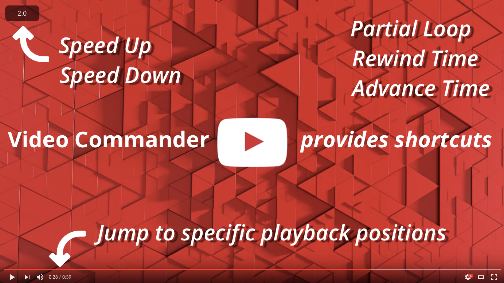

# Video Commander

Video Commander is a Chrome Extension that provides keyboard shortcuts to loop, speed up, speed down, rewind time, advance time and other handy actions. Would you like to know other actions? - see [Usage](#usage).

## Download
[Video Commander - Chrome Web Store](https://chrome.google.com/webstore/detail/video-commander/eadjicgcnpgfmklebobjkhlippgepdii)

## Usage
These shortcuts are available on video site.

* **P** or **space** - toggle play and pause
* **H** or **0** - jump to beginning
* **E** - jump to end
* **A** or **left arrow** - rewind time
* **S** or **right arrow** - advance time
* **D** - speed down
* **U** - speed up
* **R** - reset speed
* **L** - partial loop
* **1** - jump to 10% playback position
* **2** - jump to 20% playback position
* **3** - jump to 30% playback position
* **4** - jump to 40% playback position
* **5** - jump to 50% playback position
* **6** - jump to 60% playback position
* **7** - jump to 70% playback position
* **8** - jump to 80% playback position
* **9** - jump to 90% playback position
* **esc** - reset loop status
* **esc** - unfocus any elements

These shortcut keys are modifiable on options page. You can also change skip time amount(s) and whether scroll to player automatically or not.

## Change Log
See [CHANGELOG.md](https://github.com/noraworld/videocommander/blob/master/CHANGELOG.md).

## FAQ
### Q: No action works on some video sites
A: This extension only works [HTML5 video player](http://www.w3schools.com/html/html5_video.asp) (e.g. YouTube.com). It means this extension does not work on the video sites using Adobe Flash Player or other unique video player. Sorry about that.

## Support
* [日本語で見る](https://github.com/noraworld/videocommander/blob/master/README_jp.md)
